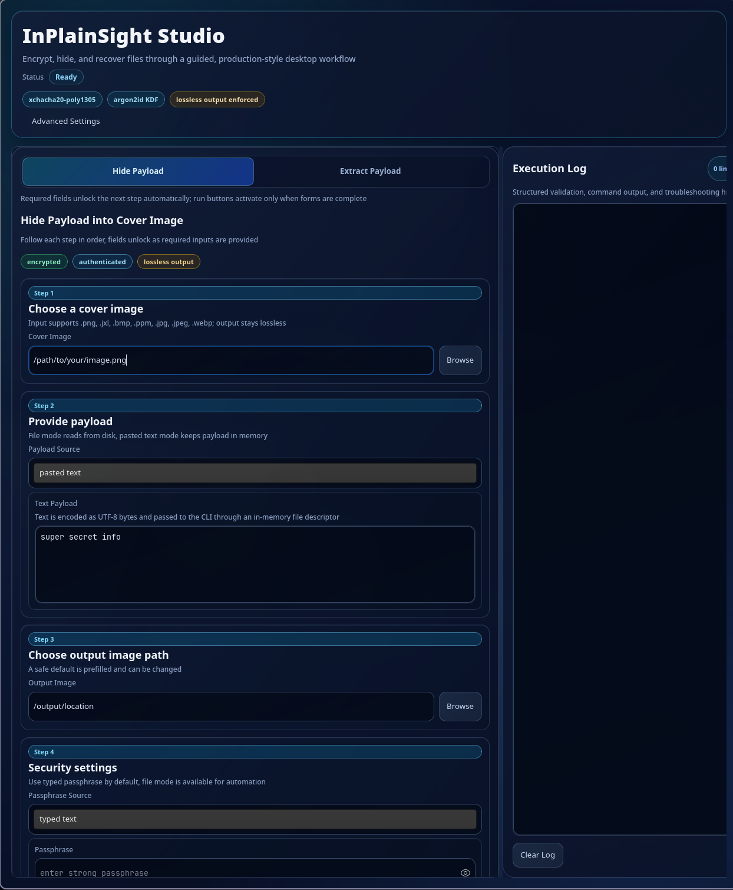

# InPlainSight

This is an educational steganography project written in C for the (CLI) with a Rust GTK4 (GUI)



## Educational Scope

- This project is for education, research, and defensive security learning
- Encryption is the security boundary
- Steganography is the storage mechanism, cryptography is what protects the payload

## Limitations (Read This First)

- Lossy re-encoding destroys pixel-domain stego
  This is why output is kept lossless for embedding modes
- Cover images have finite capacity
  Large payloads may require splitting across multiple shard images
- Dependencies may allocate internally
  The project keeps memory bounded in its own code, but image/crypto libraries can still allocate

## How It Works (High Level)

1. Read the payload bytes (a file, or text from the UI)
2. Derive keys from the passphrase (Argon2id)
3. Encrypt and authenticate the payload (XChaCha20-Poly1305)
4. Embed the encrypted bytes into a lossless cover image (pixel-domain embedding)
5. On extract: pull bytes back out, verify authentication, then write the original bytes

## CLI Usage

### Plan Capacity Before Hiding

`info` reports how much payload fits and whether splitting will be needed

```bash
./inplainsight info --cover cover.png --method lsb --lsb-bits 1 --density 1.0 --json
```

### Hide (Single Output)

```bash
./inplainsight hide \
  --cover cover.png \
  --payload payload.pdf \
  --output stego.png \
  --passphrase-file passphrase.txt \
  --method lsb
```

### Hide (Auto-Split Into Shards)

Use this when a payload does not fit in one cover

```bash
./inplainsight hide \
  --cover cover.png \
  --payload payload.pdf \
  --output stego.png \
  --passphrase-file passphrase.txt \
  --method lsb \
  --split auto \
  --output-dir stego_shards
```

### Extract (Single Image)

```bash
./inplainsight extract \
  --input stego.png \
  --output recovered_payload.bin \
  --passphrase-file passphrase.txt \
  --method auto
```

### Extract (Shard Directory)

```bash
./inplainsight extract \
  --input-dir stego_shards \
  --output recovered_payload.bin \
  --passphrase-file passphrase.txt \
  --method auto
```

## What It Does

- Hides arbitrary bytes inside supported cover images
- Uses authenticated encryption so extraction fails on tampering or wrong credentials
- Restores the original payload bytes on successful extraction
- Embeds data by modifying the least significant bits (LSBs) of pixel channel values (lossless output only)

## Supported Formats

- Cover input: `.png`, `.jxl`, `.bmp`, `.ppm`, `.jpg`, `.jpeg`, `.webp`
- Stego output: `.png`, `.jxl`, `.bmp`, `.ppm` (lossless only)

## GUI (GTK4)

The GUI is a guided workflow that runs the CLI under the hood and captures logs for troubleshooting

```bash
cd ui
cargo run
```

Optional:

- `INPLAINSIGHT_SKIP_CLI_BUILD=1` skips the C build step used by the UI build script

## Build Notes

- C dependencies: `libsodium`, `libpng`, `libjpeg`, `libwebp`, `libjxl` (optional at runtime, supported when installed)
- This repo intentionally enforces strict compiler warnings and sanitizer builds during testing

## Ethics / Responsible Use

- This project is meant for learning and defensive analysis
- Do not use it to conceal illegal activity or violate privacy expectations
  The goal is to understand how these techniques work and how they are detected

## More Details

- [Technical design and module breakdown:] (docs/TECHNICAL.md)
