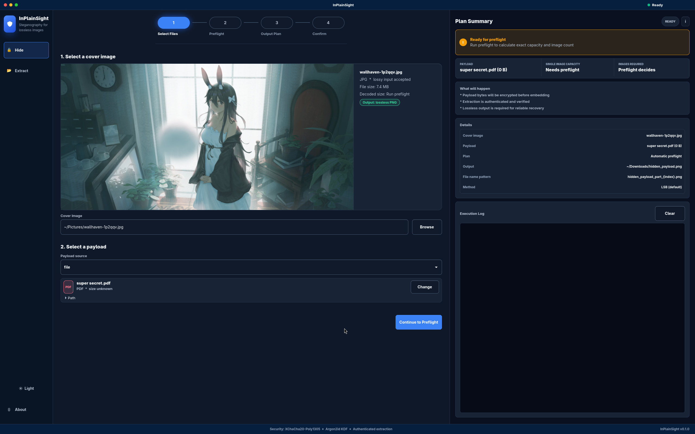
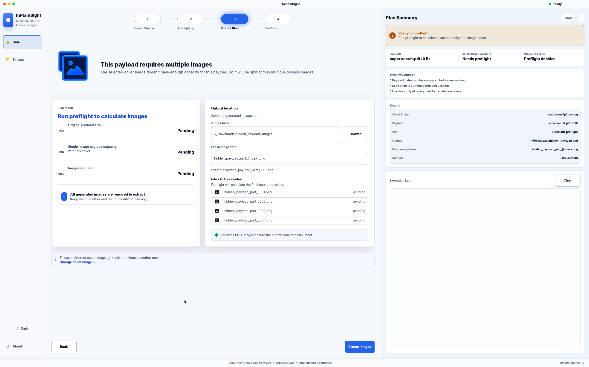

# InPlainSight

InPlainSight hides encrypted payload bytes inside lossless image files

It has two interfaces:

- A C CLI that does the actual image, crypto, capacity, hide, and extract work
- A Rust GTK4 app that provides a guided desktop workflow around the CLI





## What LSB Means

LSB means least significant bit

In an image, each pixel channel is stored as a number. Changing the smallest bit of that number usually changes the color so little that it is hard to notice by eye. LSB steganography uses that small bit position to carry hidden data

Example:

```text
original byte: 11010110
hidden bit:    1
new byte:      11010111
```

Only the last bit changed

InPlainSight uses this idea, but it does not put raw payload data directly into pixels. The payload is first packed, encrypted, and authenticated. The encrypted container bits are then written into selected pixel bytes

## How It Works

Hide flow:

1. Decode the cover image
2. Read the payload as bytes
3. Compress when it helps and the selected mode allows it
4. Build a small metadata container
5. Derive encryption keys from the passphrase
6. Encrypt and authenticate the payload container
7. Embed the encrypted container into pixel LSBs
8. Write a lossless output image

Extract flow:

1. Decode the stego image or split image folder
2. Read embedded container bytes from the pixel LSBs
3. Derive keys from the passphrase
4. Verify and decrypt the container
5. Write the recovered payload bytes

Wrong passphrases fail verification. Changed output images can also fail verification

## Why Lossless Output Matters

LSB data is fragile

PNG, BMP, PPM, and lossless JPEG XL preserve the pixel bytes well enough for recovery. JPEG and most WebP usage are lossy, which means they can rewrite pixel values and destroy hidden bits

That is why JPEG and WebP are accepted as cover inputs but not as stego outputs

## Capacity And Split Output

Capacity depends on the decoded cover image, selected LSB settings, container overhead, compression result, and payload size

The user does not choose whether the payload uses one image or many. Preflight calculates what is physically possible:

- If one image has enough room, one lossless output image is created
- If one image does not have enough room, the payload is split across every required output image

Every split output image is required for extraction

## Supported Images

Cover input:

- `.png`
- `.jxl`
- `.bmp`
- `.ppm`
- `.jpg`
- `.jpeg`
- `.webp`

Stego output:

- `.png`
- `.jxl`
- `.bmp`
- `.ppm`

## Build

Build the optimized CLI:

```sh
make
```

This writes `./inplainsight`

Run full checks:

```sh
make check
```

`make check` runs C sanitizer builds, C tests, clang-tidy, Rust formatting, Rust clippy, and Rust tests

Useful targets:

```sh
make gcc-sanitize
make clang-sanitize
make verify-c
make verify-rust
make clean
```

## Dependencies

Required:

- C11 compiler
- `make`
- `pkg-config`
- `libsodium`
- `libpng`
- `libjpeg`
- `libwebp`
- `libzstd`

Optional:

- JPEG XL libraries for `.jxl` support
- Rust and GTK4 development packages for the UI
- `clang-tidy` and `intercept-build` for full C verification

## CLI Examples

Preflight a cover and payload:

```sh
./inplainsight info \
  --cover ~/Pictures/cover.png \
  --payload ~/Documents/payload.pdf \
  --method lsb \
  --lsb-bits 1 \
  --density 1.0 \
  --json
```

Hide in one image:

```sh
./inplainsight hide \
  --cover ~/Pictures/cover.png \
  --payload ~/Documents/payload.pdf \
  --output ~/Downloads/hidden_payload.png \
  --passphrase-file ~/Documents/passphrase.txt \
  --method lsb \
  --compress auto
```

Hide across multiple images:

```sh
./inplainsight hide \
  --cover ~/Pictures/cover.png \
  --payload ~/Documents/payload.pdf \
  --split auto \
  --output-dir ~/Downloads/hidden_payload_images \
  --output-template 'hidden_payload_part_%04u.png' \
  --passphrase-file ~/Documents/passphrase.txt \
  --method lsb
```

Extract one image:

```sh
./inplainsight extract \
  --input ~/Downloads/hidden_payload.png \
  --output ~/Downloads/recovered_payload.pdf \
  --passphrase-file ~/Documents/passphrase.txt \
  --method lsb
```

Extract split images:

```sh
./inplainsight extract \
  --input-dir ~/Downloads/hidden_payload_images \
  --output ~/Downloads/recovered_payload.pdf \
  --passphrase-file ~/Documents/passphrase.txt \
  --method lsb
```

`~/...` paths are accepted by the CLI and UI

## UI

Run the GTK app:

```sh
cd ui
cargo run
```

The app follows the same pipeline as the CLI:

1. Select files
2. Run preflight
3. Review the output plan
4. Confirm and create output

## Safety Notes

- Payload bytes are encrypted before embedding
- Extraction verifies authentication before writing recovered bytes
- Output paths refuse overwrites
- Extracted payload files use private permissions
- Passphrases can be typed in the UI without being written to disk
- Generated split images must stay together and unchanged

## More Detail

- [Technical notes](docs/TECHNICAL.md)
